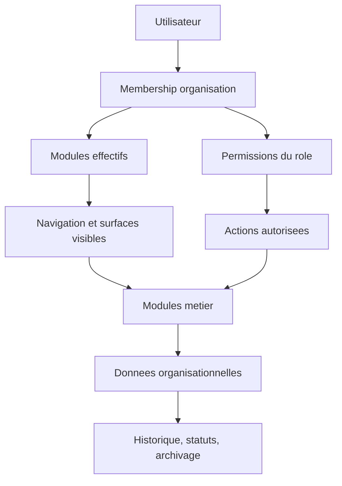

# Architecture Logique de Rucher360

## Objectif

Ce document presente l'architecture logique de Rucher360: les grands moteurs applicatifs, leur responsabilite, les flux de decision et les regles qui permettent d'ajouter des modules sans fragiliser l'ensemble.

Il complete l'architecture technique. L'architecture technique explique comment l'application est executee. L'architecture logique explique comment le produit raisonne.

## Vue d'ensemble

Rucher360 est organise autour de cinq moteurs logiques:

- moteur organisation: espaces de travail, membres et statut d'acces;
- moteur modules: catalogue produit et activation par organisation puis par adhesion;
- moteur permissions: roles et droits applicables aux actions;
- moteurs metier: ruchers, ruches, colonies, visites, taches, sanitaire, materiel, recoltes et contenus;
- moteur de gouvernance: micro-lots, validations, documentation et securite depot public.



## Regle d'acces centrale

Une fonction ne doit etre accessible que si toutes les conditions sont reunies:

```text
canAccessFeature =
  moduleExists &&
  organizationModuleEnabled &&
  membershipModuleEnabled &&
  userHasRequiredPermission
```

Cette regle protege trois aspects differents:

- visibilite: ce que l'utilisateur voit dans l'interface;
- action: ce qu'il peut faire;
- conservation: ce qui reste stocke meme si le module est masque.

Desactiver un module ne supprime jamais ses donnees.

## Moteur organisation

L'organisation est le conteneur principal de donnees et de collaboration.

Responsabilites:

- regrouper les membres;
- porter les modules actives;
- posseder les donnees metier;
- isoler les droits et donnees entre espaces de travail.

Regles:

- toute donnee metier doit etre rattachee a une organisation;
- un utilisateur peut appartenir a plusieurs organisations;
- un utilisateur peut avoir des roles et modules differents selon l'organisation.

## Moteur modules

Le moteur modules determine les surfaces disponibles.

Niveaux:

- `ModuleDefinition`: module existant dans le produit;
- `OrganizationModule`: module active ou desactive pour une organisation;
- `MembershipModulePreference`: visibilite cible pour un membre dans une organisation;
- registry applicative future: source de verite pour routes, navigation et cockpit.

Regles:

- les modules systeme ne doivent pas etre desactives s'ils sont necessaires au fonctionnement;
- les modules IA et connectes restent desactives tant qu'un lot dedie ne les active pas;
- un module peut etre visible sans autoriser toutes les actions si les permissions sont limitees.

## Moteur permissions

Les permissions determinent les actions autorisees.

Exemples:

- `apiaries.read`: consulter les ruchers;
- `apiaries.write`: creer ou modifier les ruchers;
- `modules.manage`: activer ou desactiver des modules;
- permissions futures: `transhumance.read`, `transhumance.write`, `equipment.read`, `equipment.write`.

Regles:

- les permissions sont rattachees a un role;
- un role s'applique dans une organisation;
- une permission ne doit jamais contourner un module desactive;
- les actions critiques doivent toujours verifier organisation, module et permission.

## Moteurs metier

Chaque module metier doit posseder son propre domaine et limiter ses dependances.

Principe:

- un module possede ses donnees principales;
- les liens vers d'autres modules restent optionnels;
- les traitements automatiques sont interdits tant qu'un lot dedie ne les active pas;
- les statuts et historiques sont preferes a la suppression definitive.

Exemples:

- `apiary` possede ruchers, ruches et colonies;
- `equipment` possedera types de materiel, stock leger, items et evenements;
- `transhumance` possedera les mouvements de ruches;
- `visits` pourra referencer ruches, colonies, materiel ou taches sans devenir proprietaire de ces modules.

## Flux d'une action

Flux cible pour une action applicative:

1. Identifier l'utilisateur et son adhesion active.
2. Verifier l'organisation active.
3. Calculer les modules effectifs.
4. Verifier la permission requise.
5. Charger uniquement les donnees de l'organisation.
6. Executer l'action metier.
7. Conserver un statut, un historique ou une trace si le domaine le demande.

Une interface ne suffit jamais a securiser une action. Les memes regles devront etre appliquees cote serveur.

## Gestion des donnees

Principes:

- les identifiants techniques sont opaques;
- les libelles terrain restent modifiables;
- les coordonnees de ruchers sont sensibles;
- les documents, contacts et donnees sanitaires sont sensibles;
- les suppressions metier doivent privilegier `archivedAt` ou un statut;
- les modules desactives conservent leurs donnees.

## Extension par module

Pour ajouter un module, le lot doit definir:

- son objectif produit;
- ses donnees propres;
- ses permissions;
- son activation par organisation;
- ses surfaces UI;
- ses liens optionnels avec les autres modules;
- ses hors perimetres;
- ses validations Docker et securite.

Un module ne doit pas introduire de dependance globale tant que le besoin n'est pas prouve.

## Garde-fous

Ne pas introduire sans lot dedie:

- IA active;
- IoT actif;
- appel API externe;
- paiement;
- marketplace;
- comptabilite complete;
- prescription sanitaire automatique;
- partage public de localisation.

La coherence applicative repose sur trois reflexes: module autonome, donnees conservees, permissions explicites.
