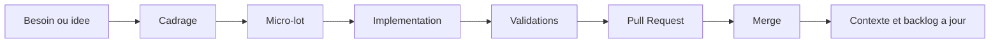

# Gouvernance des Lots et Sprints

## Objectif

Ce document decrit comment piloter les modifications de Rucher360 par micro-lots tout en gardant la coherence applicative. Il sert de guide pour preparer, executer et relire les futurs sprints.

## Principes

- Un lot doit avoir un objectif unique.
- Un lot documentaire precede les sujets transverses ou ambigus.
- Un lot technique ne doit pas cacher une decision produit.
- Un lot metier ne doit pas ajouter IA, IoT, paiement ou dependances externes sans cadrage dedie.
- Une Pull Request doit rester lisible et validable.

## Cycle recommande



## Cadrage d'un lot

Chaque lot doit preciser:

- objectif;
- perimetre;
- hors perimetre;
- fichiers autorises;
- donnees touchees;
- modules concernes;
- permissions concernees;
- validations attendues;
- effet attendu sur la documentation.

Pour un sujet transversal, creer d'abord un lot `*-00`.

Exemples:

- `EQUIPMENT-00`: cadrage materiel avant modele et UI;
- `MODULES-DYNAMIC-00`: cadrage profils et modules avant migration;
- `TRANSHUMANCE-00`: cadrage mouvement de ruches avant modele executable.

## Ordre des lots applicatifs

Ordre recommande pour une fonctionnalite metier:

1. cadrage documentaire;
2. modele de donnees minimal;
3. types et helpers purs;
4. shell ou ecran statique;
5. actions serveur securisees;
6. formulaires et CRUD;
7. liens inter-modules;
8. automatisation seulement si un lot dedie l'autorise.

Cet ordre evite de construire une interface avant d'avoir stabilise les regles metier.

## Definition of Done

Un lot est pret si:

- le perimetre demande est complet;
- les hors perimetres sont respectes;
- la documentation touchee est a jour;
- `docs/context.md`, `docs/todo.md` et `docs/journal.md` sont coherents;
- les controles Docker et securite pertinents passent;
- aucun secret ou export local n'est pousse;
- la PR explique clairement ce qui est fait et ce qui ne l'est pas.

## Validations de reference

Pour tout lot:

```bash
git diff --check
make security-scan
docker compose config
```

Pour un lot applicatif:

```bash
docker compose run --rm app pnpm lint
docker compose run --rm app pnpm build
```

Pour un lot Prisma:

- executer les commandes Prisma uniquement via Docker Compose;
- verifier la migration;
- verifier que le schema reste multi-organisation;
- ne pas ajouter de donnees reelles.

## Gestion des changements

Avant de modifier une zone existante:

- lire le document de module concerne;
- verifier les decisions dans `docs/context.md`;
- verifier les derniers changements dans `docs/journal.md`;
- identifier les PR ouvertes qui touchent les memes documents;
- eviter les refontes hors perimetre.

Si deux lots touchent les memes docs, documenter le risque de rebase dans la PR.

## Coherence produit

Une modification doit respecter les invariants suivants:

- une organisation possede les donnees;
- un module peut etre desactive sans suppression;
- un role donne les permissions;
- une interface visible n'est pas une autorisation suffisante;
- les liens entre modules restent optionnels;
- les donnees sensibles sont minimisee;
- les modules IA et IoT restent inactifs tant qu'ils ne sont pas explicitement livres.

## Gestion des sprints

Un sprint doit contenir peu de lots et suivre une progression lisible.

Exemple de sprint fondations modulaires:

- `MODULES-DYNAMIC-01`;
- `MODULES-REGISTRY-01`;
- `USER-PROFILE-MODULES-01`.

Exemple de sprint materiel:

- `EQUIPMENT-01`;
- `EQUIPMENT-SHELL-01`;
- `EQUIPMENT-CRUD-01`.

Exemple de sprint transhumance:

- `TRANSHUMANCE-00`;
- `HIVE-MOVEMENTS-01`;
- `TRANSHUMANCE-SHELL-01`.

## Revue de Pull Request

La revue doit verifier:

- le lot respecte son titre;
- aucune fonctionnalite interdite n'a ete ajoutee;
- les donnees sensibles ne sont pas exposees;
- les commandes Node, pnpm, Prisma et Next passent par Docker Compose;
- les modules desactives ne declenchent aucun traitement;
- le README ou les docs de reference sont mis a jour si le comportement change.

Une PR qui melange cadrage, migration, UI et CRUD doit etre scindee sauf justification explicite.
